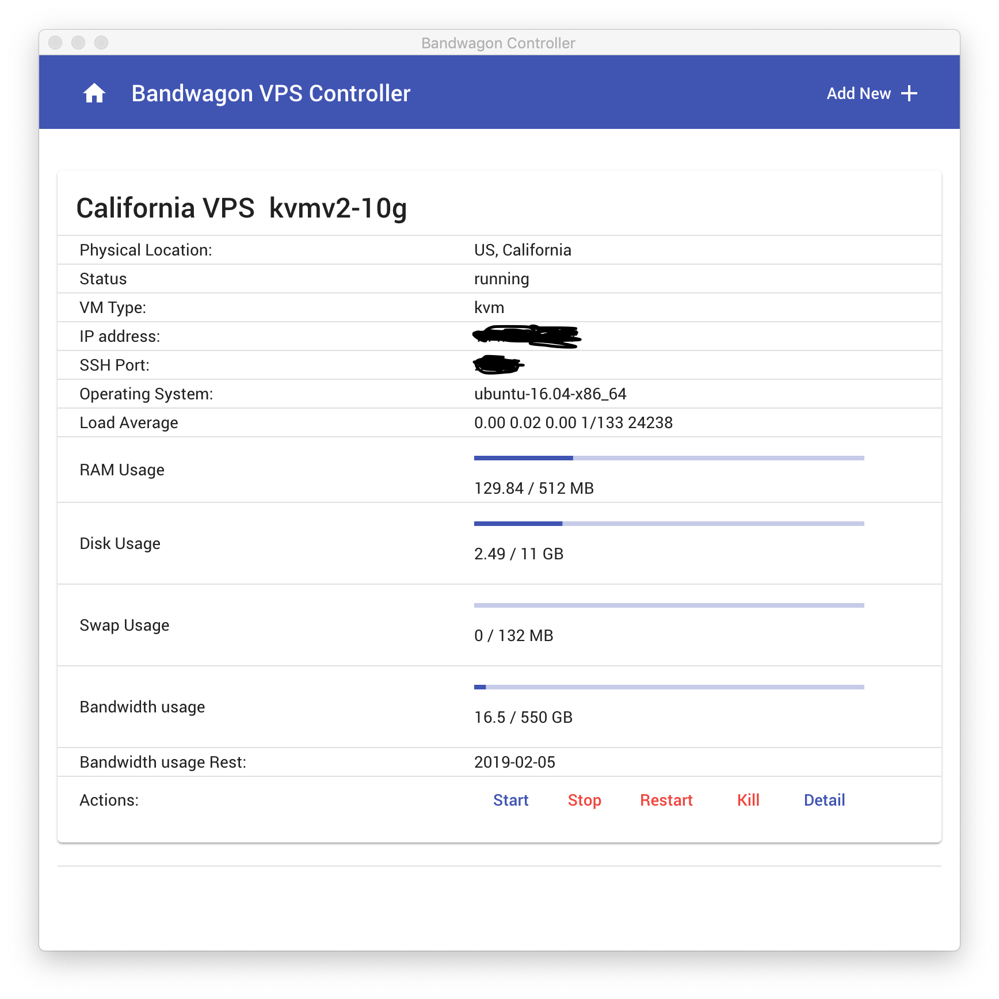
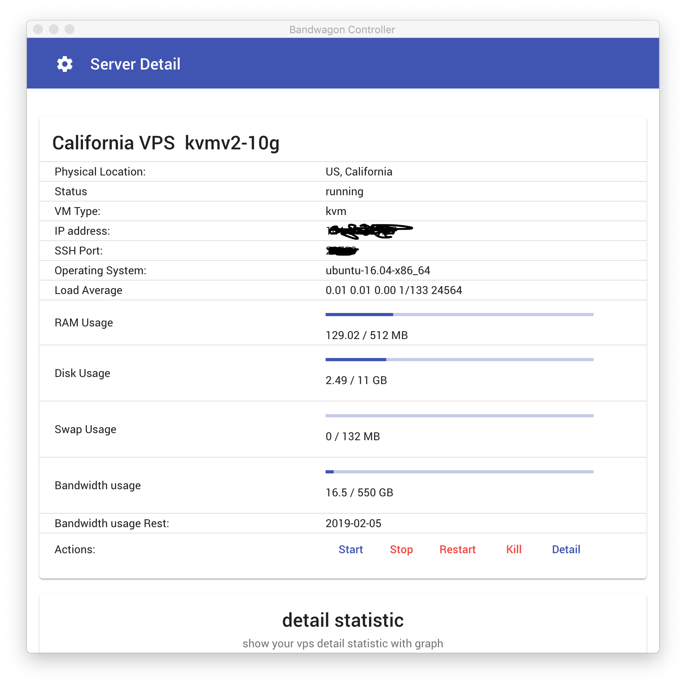
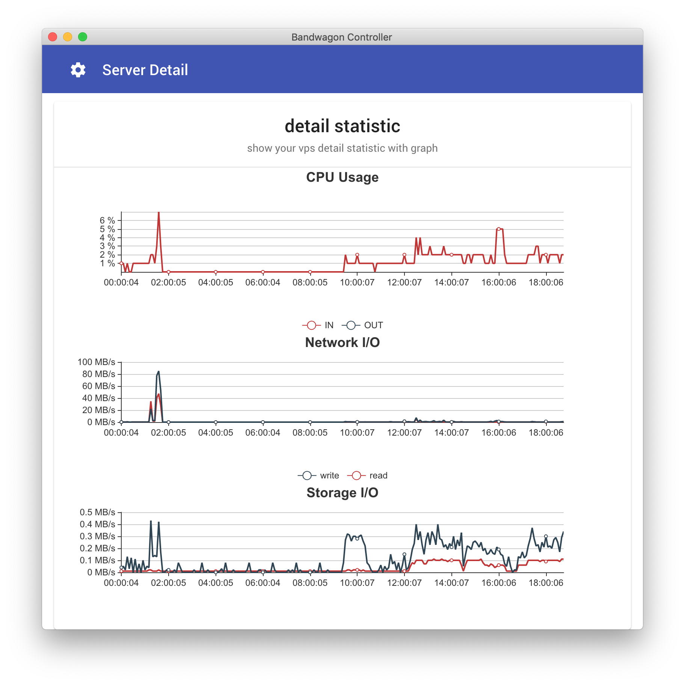

[](https://angular.io/) [](https://electronjs.org/)

# Introduction

Bandwagon VPS controller PC client build on Electron + Angular

## Getting Started

Clone this repository locally :

``` bash
git@github.com:zgm4z/Bandwagon-controller.git
```

Install dependencies with npm :

``` bash
npm install
```

If you want to generate Angular components with Angular-cli , you **MUST** install `@angular/cli` in npm global context.
Please follow [Angular-cli documentation](https://github.com/angular/angular-cli) if you had installed a previous version of `angular-cli`.

``` bash
npm install -g @angular/cli
npm run start
```

## ScreenShot







## TODO

more feature under devlopent，coming soon...